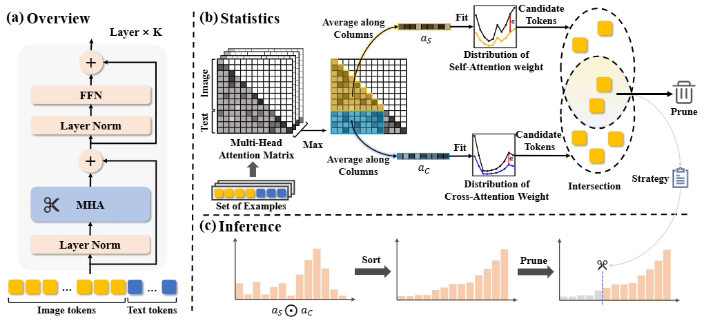

# Fit and Prune: Fast and Training-free Visual Token Pruning for Multi-modal Large Language Models  
[[paper](https://arxiv.org/abs/2409.10197)]



## TL;DR
We introduce **FitPrune**, a method that generates an efficient token pruning strategy for multi-modal large language models (MLLMs) by removing redundant visual tokens. FitPrune is easy to deploy and designed to meet a predefined computational budget while maintaining model performance.

## News
- **[2024/09/16]** Inference acceleration code for **LLaVA 1.5** is now released!

## TODOs

We will release the code and data in the following stages:

- [x] Release inference acceleration code for **LLaVA 1.5**.
- [ ] Release inference acceleration code for **LLaVA Next** and **LLaVA-HR**.
- [ ] Release statistical analysis scripts.

## Demos
Here are some example results showing the pruning efficiency with different compression rates on LLaVA1.5:

 
 
 

## Abstract
Recent progress in Multimodal Large Language Models(MLLMs) often use large image tokens to compensate the visual shortcoming of MLLMs, which not only exhibits obvious redundancy but also greatly exacerbates the already high computation. Token pruning is an effective solution for speeding up MLLMs, but when and how to drop tokens still remains a challenge. In this paper, we propose a novel and training-free approach for the effective visual token pruning of MLLMs, termed FitPrune, which can quickly produce a complete pruning recipe for MLLMs according to a pre-defined budget. Specifically, FitPrune considers token pruning as a statistical problem of MLLM and its objective is to find out an optimal pruning scheme that can minimize the divergence of the attention distributions before and after pruning. In practice, FitPrune can be quickly accomplished based on the attention statistics from a small batch of inference data, avoiding the expensive trials of MLLMs. According to the pruning recipe, an MLLM can directly remove the redundant visual tokens of different examples during inference. To validate FitPrune, we apply it to a set of recent MLLMs, including LLaVA-1.5, LLaVA-HR and LLaVA-NEXT, and conduct extensive experiments on a set of benchmarks. The experimental results show that our FitPrune can not only reduce the computational complexity to a large extent, while retaining high performance, e.g., -54.9% FLOPs for LLaVA-NEXT with only 0.5% accuracy drop. Notably, the pruning recipe can be obtained in about 5 minutes. 

## Usage(LLaVA1.5)

### Environment Setup

```bash
git  clone -b v1.1.3 https://github.com/haotian-liu/LLaVA.git  FitPrune_LLaVA1.5
cd FitPrune_LLaVA1.5

conda create -n llava python=3.10 -y
conda activate llava
pip install --upgrade pip  # enable PEP 660 support
pip install -e .
```

### Run Inference with FitPrune on LLaVA 1.5

```bash
# example
# adjust the reduction_ratio parameter to control the token pruning rate
bash scripts/v1_5/eval/textvqa.sh  
```


## Citation

If you find **FitPrune** useful, please kindly cite our paper:

```bibtex
@article{fitprune2024,
        title={Fit and Prune: Fast and Training-free Visual Token Pruning for Multi-modal Large Language Models},
        author={Weihao Ye, Qiong Wu, Wenhao Lin, Yiyi Zhou},
        journal={arXiv preprint arXiv:2409.10197},
        year={2024}
}
```
