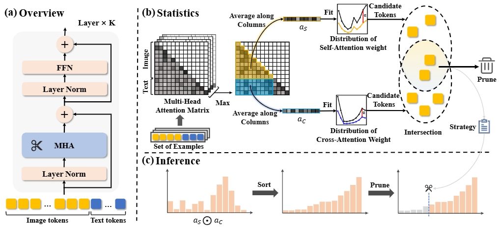

# Fit and Prune: Fast and Training-free Visual Token Pruning for Multi-modal Large Language Models  
[[paper](https://arxiv.org/abs/2409.10197)]



## TL;DR
We introduce **FitPrune**, a method that generates an efficient token pruning strategy for multi-modal large language models (MLLMs) by removing redundant visual tokens. FitPrune is easy to deploy and designed to meet a predefined computational budget while maintaining model performance.

## News
- **[2024/09/16]** Inference acceleration code for **LLaVA 1.5** is now released!
- **[2024/10/22]** Statistical analysis code for **LLaVA 1.5** is now released!
- **[2024/12/10]** Our paper **FitPrune** has been accepted to **AAAI 2025**! 🎉 

## TODOs

We will release the code and data in the following stages:

- [x] Release inference acceleration code for **LLaVA 1.5**.
- [x] Release statistical analysis scripts.
- [x] Release inference acceleration code for **LLaVA Next** and **LLaVA-HR**.


## Demos
Here are some example results showing the pruning efficiency with different compression rates on LLaVA1.5:

<p align="center">
  <div style="display: inline-block; text-align: center; margin-right: 10px;">
    
    
  </div>
</p>


## Usage  


### 1️⃣ LLaVA 1.5  

#### Environment Setup  

1. Navigate to the directory:  

   ```bash
   cd LLaVA_1.5
   ```  

2. Follow the instructions in `LLaVA_1.5/README.md` to set up the environment.  

#### Run Inference  

```bash
# example
# adjust the --reduction_ratio parameter to control the token pruning rate
bash scripts/v1_5/eval/textvqa.sh
```  

#### Statistical Analysis  

```bash
CUDA_VISIBLE_DEVICES=0 python llava/eval/statistical_analysis.py --model-path liuhaotian/llava-v1.5-7b --question-file ./llava/eval/statistical_analysis_data.jsonl --image-folder /data/LLaVA/data/ --reduction_ratio 0.6
```  

- Replace `./llava/eval/statistical_analysis_data.jsonl` with your dataset following the same structure.  
- Set `image-folder` to the directory containing your images.  

---

### 2️⃣ LLaVA-HR  

#### Environment Setup  

1. Navigate to the directory:  

   ```bash
   cd LLaVA_HR
   ```  

2. Follow the instructions in `LLaVA_HR/README.md` to set up the environment.  

#### Run Inference  

```bash
CUDA_VISIBLE_DEVICES=0 bash scripts/v1_5/eval_full/textvqa.sh /path/to/llava-hr-7b-sft-1024
```  

- Use the `--reduction_ratio` parameter in the script to control the token pruning rate.  
- The main FitPrune modifications are in `llava_hr/model/language_model/modeling_llama.py`.  

---

### 3️⃣ LLaVA-Next  

#### Environment Setup  

1. Navigate to the directory:  

   ```bash
   cd LLaVA_NEXT
   ```  

2. Follow the instructions in `LLaVA_NEXT/README.md` to set up the environment.  

#### Run Inference  

```bash
bash scripts/v1_5/eval/textvqa.sh
```  

- Use the `--reduction_ratio` parameter in the script to control the token pruning rate.  
- The main FitPrune modifications are in `llava/model/language_model/modeling_llama.py`.  


## Citation

If you find FitPrune useful, please kindly cite our paper. Thank you!

```bibtex
@article{fitprune2024,
        title={Fit and Prune: Fast and Training-free Visual Token Pruning for Multi-modal Large Language Models},
        author={Weihao Ye, Qiong Wu, Wenhao Lin, Yiyi Zhou},
        journal={arXiv preprint arXiv:2409.10197},
        year={2024}
}
```
